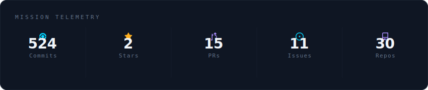

<!-- Galaxy Profile README Template
     Customize this file with your own info, then rename it to README.md
     in your GitHub profile repo (github.com/YOUR_USERNAME/YOUR_USERNAME).
     The SVG paths below point to assets/generated/ which are auto-generated
     by the GitHub Actions workflow or by running: python -m generator.main -->

  

 

  

 

  

 

  

 

 

  
  

 

     
Carrer Path

      

 
**Backend Developer** | Node.js | APIs (REST/GraphQL) | Kafka & Event-Driven | PostgreSQL/MongoDB | Testes (Mocha/Sinon)

📍 Itumbiara – GO, Brasil   
🔗 [LinkedIn](https://linkedin.com/in/luancyrne)

---

## 🔵 Resumo Profissional

Backend Developer com **+6 anos** de experiência em sistemas de produção que impactaram **+26 cidades**. Iniciei no suporte técnico, o que me ensinou a priorizar código que resolve problemas reais e gera valor.

Especializado em **Node.js**, APIs escaláveis (**REST/GraphQL**), **Kafka** (event-driven), integrações complexas e ambientes de alta escala. Atuei em projetos para **BB Seguros**, **Autopass Top+** e **Caixa Econômica Federal**, sempre focando em estabilidade, performance e entregas contínuas.

**Destaques:**
- **14+ projetos** entregues (APIs, web, mobile, dashboards)
- Soluções de impacto para grandes empresas
- Jornada: suporte → engenharia → produção real

Atualmente focado em backends resilientes, processamento assíncrono e arquitetura event-driven.

## 🌊 Comunidade

Um dos fundadores e administrador da **[MantisCode - Guia de Sistemas](https://discord.gg/mNxWkSNt)** no Discord, com **+600 membros** ativos. Espaço dedicado a devs brasileiros para compartilhar conhecimento, code reviews, mentorias, lives e networking.

Convite aberto: https://discord.gg/mNxWkSNt 💙  
(Junte-se para trocar ideias e crescer na tecnologia!)

---

## 🏢 Empresas & Clientes Atendidos

- **CNX Telecom** (Abr 2025 – Out 2025 | Remoto - PJ)  
  App mobile completo (React Native + Node.js), APIs REST, site institucional (React + Strapi), dashboards e pipeline de produção.

- **Minu.co** (Mar 2023 – Mar 2025 | Remoto)  
  BB Seguros (portal Next.js + Auth0), Autopass Top+ (Kafka + GraphQL), Caixa Econômica Federal (MVP bancário).

- **Talent Group** (Set 2022 – Dez 2022 | Remoto)  
  Interfaces Nuxt.js, hotfixes e manutenção de design system.

- **CNX Telecom** (Ago 2019 – Set 2022 | Presencial)  
  Chat multiatendimento (React + Socket.io), mídia indoor real-time (+29 filiais) e automações internas.

- **Medicamental** (Mar 2018 – Jul 2019 | Presencial)  
  Automação logística com Excel/VBA (início na tecnologia).

---

## 🚀 Projetos em Destaque

- App Mobile Telecom → React Native + Node.js (do zero à App Store)  
- Portal BB Seguros → Next.js + Strapi + Auth0 + AWS S3  
- Plataforma Autopass Top+ → Node.js + Kafka + MongoDB + GraphQL + Mocha/Sinon  
- Clube Caixa MVP → REST/GraphQL + mensageria bancária  
- Chat Interno → React + Node.js + PostgreSQL + Socket.io  
- Mídia Indoor Real-Time → Node.js + React + MongoDB + WebSockets (29+ filiais)

---

## 🌟 Repositórios em Destaque

- **[librelinkup-api](https://github.com/luancyrne/librelinkup-api)** 💙  
  Wrapper Node.js para API LibreLinkUp (monitoramento de glicose). Techs: Node.js, Axios, Jest.

- **[btc-finder](https://github.com/lmajowka/btc-finder)** (Contribuidor)  
  Código educacional brute-force Bitcoin. JS + Docker (+100 stars).

- **[btcgo](https://github.com/lmajowka/btcgo)** (Contribuidor)  
  Versão otimizada em Go + paralelismo (+80 stars).

---

## 🛠️ Tech Stack

### Languages & Frameworks

### Databases

### APIs & Architecture

### Testing & Security

### DevOps & Cloud

### Frontend

---

## 🎓 Formação & Certificados

- Ciência da Computação – Estácio de Sá  
- Desenvolvimento Web – Google Activate  
- Tecnologia da Informação e Comunicação – SENAI GO  
- Lógica de Programação – SENAI GO  
- Reparador e Montador de Computadores – SENAI GO  

## 🌍 Idiomas

- Português: Nativo  
- Espanhol: Avançado  
- Inglês: Intermediário  

---

Vamos construir algo incrível juntos? 🚀💙  
Me chama no LinkedIn, e-mail ou no Discord da comunidade!

